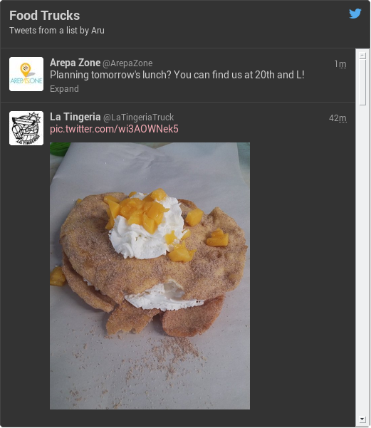
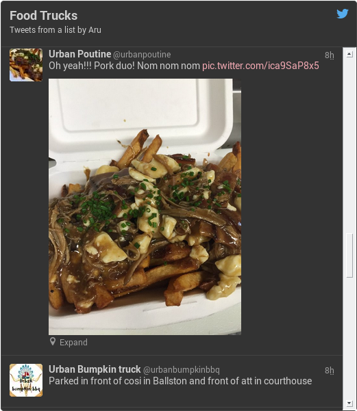

# ngTweet

Easily embed Twitter widgets into your Angular application! No more having to kludge together a Twitter script loader, or manage embed state on route/visibility change.

## Installation

### Node

```console
npm install --save ngtweet
```

### Bower

```console
$ bower install ngtweet
```

Then include `ngtweet.js` or `ngtweet.min.js` in your markup and add `ngtweet` to your application's dependencies.  Your markup should look like this at the end:

```html
<!doctype html>
<html ng-app="myApp">
<head>
    <script src="//ajax.googleapis.com/ajax/libs/angularjs/1.4.1/angular.min.js"></script>
    <script src="bower_modules/ngtweet/dist/ngtweet.min.js"></script>
    <script type="text/javascript" charset="utf-8">
        var myApp = angular.module('myApp', ['ngtweet']);
    </script>
    ...
</head>
<body>
    ...
</body>
</html>
```

## Usage

There are two ways to embed a Twitter widget - with the source from Twitter (*embedded*), or via Tweet ID (*linked*).

### Embedded Tweet

Given the source for an embedded Tweet

```html
<blockquote class="twitter-tweet" lang="en"><p lang="en" dir="ltr">&quot;No one likes Bit O&#39; Honey.&quot; ~<a href="https://twitter.com/griffinmcelroy">@griffinmcelroy</a> <a href="https://twitter.com/hashtag/truth?src=hash">#truth</a></p>&mdash; Aru (@IAmAru) <a href="https://twitter.com/IAmAru/status/608455483507245059">June 10, 2015</a></blockquote>
<script async src="//platform.twitter.com/widgets.js" charset="utf-8"></script>
```

First, remove the `<script>` element from the markup.  Then, simply wrap it in a `<twitter-widget>` tag:

```html
<twitter-widget>
<blockquote class="twitter-tweet" lang="en"><p lang="en" dir="ltr">&quot;No one likes Bit O&#39; Honey.&quot; ~<a href="https://twitter.com/griffinmcelroy">@griffinmcelroy</a> <a href="https://twitter.com/hashtag/truth?src=hash">#truth</a></p>&mdash; Aru (@IAmAru) <a href="https://twitter.com/IAmAru/status/608455483507245059">June 10, 2015</a></blockquote>
</twitter-widget>
```

Load your app, and you get:


### Linked Tweet

Given a Tweet with ID '617749885933232128', simply add a `<twitter-widget>` tag to your markup with an attribute named `twitter-widget-id` specifying the Tweet ID.

```html
<twitter-widget twitter-widget-id="'617749885933232128'">
</twitter-widget>
```


### Embedded Timeline

Given the source for an embedded timeline.

```html
<a class="twitter-timeline"  href="https://twitter.com/IAmAru/lists/food-trucks" data-widget-id="673710543212052480">Tweets from https://twitter.com/IAmAru/lists/food-trucks</a>
<script>!function(d,s,id){var js,fjs=d.getElementsByTagName(s)[0],p=/^http:/.test(d.location)?'http':'https';if(!d.getElementById(id)){js=d.createElement(s);js.id=id;js.src=p+"://platform.twitter.com/widgets.js";fjs.parentNode.insertBefore(js,fjs);}}(document,"script","twitter-wjs");</script>
```

Remove the `<script>` element from the markup. Then wrap it in a `<twitter-timeline>` tag:

```html
<twitter-timeline>
    <a class="twitter-timeline" href="https://twitter.com/IAmAru/lists/food-trucks" data-widget-id="673710543212052480"> Tweets from https://twitter.com/IAmAru/lists/food-trucks</a>
</twitter-timeline>
```

Load your app, and you get:



### Linked Timeline

Given a timeline with ID '673710543212052480', simply add a `<twitter-timeline>` tag to your markup with an attribute named `twitter-timeline-id` specifying the Timeline ID.

```html
<twitter-timeline twitter-timeline-id="'6673710543212052480'">
</twitter-timeline>
```



## Additional features

### Eagerly load the Twitter widget script

The first time the `twitterWidget` directive is encountered, ngTweet downloads Twitter's Widget script.  If you would rather the script be downloaded at app startup, simply add the `twitter-widget-initialize` attribute to an element. For example,

```html
<html ng-app="myapp">
    <body twitter-widget-initialize>
    </body>
</html>
```

### Configuration

You can change the source of the `widget.js` file in case you want to host your own version:

```javascript
angular.module("myApp", ['ngtweet'])
.run(function(TwitterWidgetFactory)){
  TwitterWidgetFactory.setWidgetURL("PATH/TO/widgets.js"); // default https://platform.twitter.com/widgets.js
}
```


## Contributing

Pull requests are welcomed!  The existing code follows John Papa's wonderful [Angular Style Guide](https://github.com/johnpapa/angular-styleguide). Run `gulp build` to generate the debug and minified JavaScript files, and then `gulp serve` to run the demo site to verify embeds work.  Please include the compiled code within the `dist/` directory with your PR.

## The Future (tm)

This is very much a young library, so I'm open to suggestions as to what direction it should go.  Currently I'm planning on adding eventing features and promise support for render events.
